# 2. Arquitetura

O FilaZap segue os princípios de **Clean Architecture** com elementos de **DDD**
(Domain-Driven Design). O objetivo é separar responsabilidades para que a regra de
negócio seja independente de framework, framework web, banco de dados ou infraestrutura.

## 2.1 Camadas

```plantuml
@startuml
!theme plain
skinparam componentStyle rectangle
skinparam shadowing false
skinparam linetype ortho

title FilaZap — Arquitetura do Backend (Clean Architecture + DDD)

actor "Cliente\n(Dashboard Web)" as Browser
actor "Meta WhatsApp\nCloud API" as Meta
actor "Resend\n(e-mail)" as Resend
actor "Supabase Storage\n/ Local FS" as Storage

package "Presentation (Next.js App Router)" as Presentation {
  [Rotas de API\n`src/app/api/**`\n(GET/POST/...)] as Routes
  [Validadores Zod\n`src/presentation/validators`] as Validators
  [Helpers\n`session.ts` · `helpers.ts`] as Helpers

  Routes -[hidden]right- Validators
  Validators -[hidden]right- Helpers
}

package "Application" as Application {
  package "Use-cases (`use-cases/`)" as UseCases {
    [Authenticate] as ucAuth
    [CreateOrganization] as ucOrg
    [RegisterChannel] as ucChannel
    [ReceiveWhatsAppMessage] as ucReceive
    [SendMessage] as ucSend
    [AssignNextTicket] as ucAssignNext
    [AssignTicket] as ucAssign
    [FinishTicket / ReopenTicket / MoveTicketToWaitingCustomer] as ucTicket
    [ListQueue / ListMessages / GetMetrics] as ucQuery
    [InviteMember / RemoveMember] as ucMember
    [RequestPasswordReset / ResetPassword] as ucReset
    [SendTeamChatMessage / HeartbeatTeamChat] as ucTeam
    [VerifyWebhook / UpdateMessageStatus] as ucWebhook
  }

  [Policies\n`OrganizationPolicy` (RBAC)] as Policies
  [DTOs\n`src/application/dto`] as DTOs

  package "Ports (interfaces)" as Ports {
    [ContactRepository\nTicketRepository\nMessageRepository\n... *Repository] as RepoPorts
    [WhatsAppGateway] as PortGateway
    [WhatsAppWebhookParser] as PortParser
    [WebhookSignatureVerifier] as PortVerifier
    [CredentialCipher] as PortCipher
    [TokenService\nPasswordHasher] as PortAuth
    [PasswordResetMailer] as PortMailer
    [MediaStorage] as PortStorage
    [Clock\nAuditLogger] as PortMisc
  }
}

package "Domain (núcleo — sem dependências externas)" as Domain {
  package "Entities" as Entities {
    [User\nOrganization\nOrganizationMember] as EntIdentity
    [WhatsAppChannel\nContact\nTicket] as EntChannel
    [Message\nInternalNote\nTicketEvent\nWebhookEvent] as EntFlow
  }
  package "Value Objects" as VOs {
    [Email\nPhoneNumberE164\nSlug] as VO1
    [Role\nTicketStatus\nMessageDirection\nChannelStatus\nWebhookEventStatus] as VO2
  }
  [Errors\n`DomainError` + derivados] as Errors
  [Services\n`Clock`] as DomainServices
}

package "Infrastructure (adapters)" as Infrastructure {
  package "Database (Prisma)" as InfraDB {
    [PrismaContactRepository\nPrismaTicketRepository\nPrismaMessageRepository\n... Prisma*Repository] as PrismaRepos
    [PrismaClient\n`prisma.ts`] as PrismaClient
  }
  package "Auth" as InfraAuth {
    [JwtTokenService] as Jwt
    [BcryptPasswordHasher] as Bcrypt
  }
  package "Security" as InfraSec {
    [Aes256GcmCredentialCipher] as Cipher
  }
  package "WhatsApp" as InfraWa {
    [MetaWhatsAppGateway] as WaGateway
    [MetaWhatsAppWebhookParser] as WaParser
    [MetaWebhookSignatureVerifier] as WaVerifier
  }
  package "Email" as InfraEmail {
    [ResendPasswordResetMailer] as Mailer
  }
  package "Storage" as InfraStorage {
    [SupabaseMediaStorage\nLocalMediaStorage] as Media
  }
  package "Observability" as InfraObs {
    [ConsoleAuditLogger] as Audit
  }
}

database "PostgreSQL" as PG

[Container\n`src/container.ts`\n(composition root / injeção de dependências)] as Container

' Fluxo de requisição (dependências apontam para dentro)
Browser --> Routes : HTTP + JWT
Routes --> Validators : valida entrada
Routes --> Helpers : sessão / resposta
Routes --> UseCases : delega `execute()`

UseCases --> Policies : aplica RBAC
UseCases --> DTOs : contratos in/out
UseCases --> RepoPorts : usa abstrações
UseCases --> PortGateway
UseCases --> PortMailer
UseCases --> PortStorage
UseCases --> PortMisc

Policies --> EntIdentity : lê entidade
UseCases --> EntChannel : manipula entidades
UseCases --> EntFlow
EntChannel ..> Errors : lança erros de domínio
EntChannel ..> VO1 : contém VOs
EntChannel ..> VO2

' Inversão de dependência: infra implementa os ports
PrismaRepos ..> RepoPorts : implementa
WaGateway ..> PortGateway : implementa
WaParser ..> PortParser : implementa
WaVerifier ..> PortVerifier : implementa
Cipher ..> PortCipher : implementa
Jwt ..> PortAuth : implementa
Bcrypt ..> PortAuth : implementa
Mailer ..> PortMailer : implementa
Media ..> PortStorage : implementa
Audit ..> PortMisc : implementa

' Container conecta use-cases aos adapters
Container ..> UseCases : instancia
Container ..> PrismaRepos : injeta
Container ..> WaGateway : injeta
Container ..> Mailer : injeta
Container ..> Media : injeta
Container ..> Jwt : injeta
Container ..> Cipher : injeta

' Infra → sistemas externos
PrismaRepos --> PrismaClient
PrismaClient --> PG
WaGateway --> Meta : envia mensagens
Meta --> Routes : webhook\n(POST /api/webhooks/whatsapp)
Mailer --> Resend : e-mail de reset
Media --> Storage : mídia
@enduml
```



> 📎 Versão standalone do diagrama (renderizável com PlantUML):
> [`docs/diagrams/backend.puml`](./diagrams/backend.puml).

As dependências apontam **para dentro**: `presentation` depende de `application`, que
depende de `domain`. A camada interna (`domain`) não conhece nenhuma outra. A
`infrastructure` **implementa** os ports definidos em `application` (inversão de
dependência) e é conectada aos use-cases pelo **container** (`src/container.ts`).

### 2.1.1 `src/domain` — Regra de negócio pura

- **Entidades** (`entities/`): `User`, `Organization`, `OrganizationMember`,
  `Ticket`, `Contact`, `Message`, `InternalNote`, `TicketEvent`, `WebhookEvent`,
  `WhatsAppChannel`. Contêm lógica e invariantes de negócio (ex.: transições de status
  do ticket).
- **Value objects** (`value-objects/`): `Email`, `PhoneNumberE164`, `Slug`, `Role`,
  `TicketStatus`, `MessageDirection`, `ChannelStatus`, `WebhookEventStatus`.
- **Errors** (`errors/`): exceções de domínio tipadas (`TicketNotFoundError`,
  `ForbiddenRoleError`, etc.), estendendo `DomainError`.
- **Services** (`services/`): lógica reutilizável de domínio, ex.: `Clock`.

Padrão comum das entidades: factory `create(...)`, método `restore(...)` (para
reconstruir a partir de JSON) e `toJSON()`.

### 2.1.2 `src/application` — Casos de uso

- **Use-cases** (`use-cases/`): cada caso de uso orquestra uma operação, injeta seus
  dependências e aplica políticas. Implementado como classe com método `execute()`.
- **DTOs** (`dto/`): contratos de entrada/saída dos casos de uso.
- **Policies** (`policies/`): `OrganizationPolicy` aplica RBAC dentro dos use-cases.
- **Ports** (`ports/`): interfaces (abstrações) que definem o contrato dos repositórios
  e serviços externos (`ContactRepository`, `WhatsAppGateway`, `CredentialCipher`, etc.).

### 2.1.3 `src/infrastructure` — Adaptação ao externo

- **Database** (`database/`): `Prisma*Repository` (implementações dos ports de repositório)
  e o cliente Prisma (`prisma.ts`).
- **auth**: `BcryptPasswordHasher`, `JwtTokenService`.
- **security**: `Aes256GcmCredentialCipher` (criptografia de credenciais em repouso).
- **whatsapp**: `MetaWhatsAppGateway` (envio), `MetaWhatsAppWebhookParser`,
  `MetaWebhookSignatureVerifier`.
- **email**: `ResendPasswordResetMailer` (implementação do port `PasswordResetMailer`).
- **storage**: `SupabaseMediaStorage` / `LocalMediaStorage` (implementações do port
  `MediaStorage` — mídia de mensagens).
- **observability**: `ConsoleAuditLogger` (implementação do port `AuditLogger`).

### 2.1.4 `src/presentation` — Interface web/API

- **api**: rotas do Next.js (`app/api/**`) e helpers (`helpers.ts`, `session.ts`).
- **validators**: schemas Zod aplicados nas entradas das rotas.

## 2.2 Injeção de dependências e container

O **container** (`src/container.ts`) é o ponto de composição (composition root). Ele:

- Instancia os repositórios Prisma e os serviços de infraestrutura.
- Conecta cada **use-case** aos seus ports (repositórios, clock, logger, gerador de ID).
- Expõe o objeto `useCases`, consumido pelas rotas (`src/app/api/**`).

```ts
import { useCases } from '@/container';
// ...na rota: await useCases.assignTicket.execute({...})
```

Isso mantém as rotas finas: autenticam, validam e delegam ao use-case.

## 2.3 Ports (interfaces de infraestrutura)

Exemplos de ports em `src/application/ports/`:

| Port | Responsabilidade |
|------|------------------|
| `*Repository` | CRUD de entidades (contrato, não implementação). Inclui `UserRepository`, `OrganizationRepository`, `OrganizationMemberRepository`, `WhatsAppChannelRepository`, `ContactRepository`, `TicketRepository`, `MessageRepository`, `InternalNoteRepository`, `TicketEventRepository`, `WebhookEventRepository`, `PasswordResetRepository`, `TeamChatRepository`. |
| `WhatsAppGateway` | Envio de mensagens. |
| `WhatsAppWebhookParser` | Converte payload bruto do WhatsApp em modelo interno. |
| `CredentialCipher` | Criptografia/criptografia reversa de credenciais em repouso. |
| `TokenService` | Emissão/validação de JWT. |
| `PasswordHasher` | Hash/verificação de senhas. |
| `WebhookSignatureVerifier` | Verifica assinatura HMAC do webhook. |
| `PasswordResetMailer` | Envio de e-mail de redefinição de senha. |
| `MediaStorage` | Armazenamento de mídia (Supabase Storage ou disco local). |
| `Clock` | Abstração do tempo (testável). |
| `AuditLogger` | Registro de eventos de auditoria. |

## 2.4 Convenções de importação

- `@/` → raiz do projeto (ex.: `@/container`, `@/application/use-cases`).
- Ver `tsconfig.json` para a configuração completa de paths.

> 📎 Ver **[05-api.md](./05-api.md)** e **[06-casos-de-uso.md](./06-casos-de-uso.md)**.
