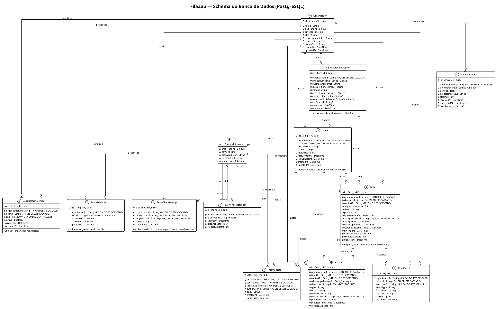

# 4. Banco de Dados

O banco é o **PostgreSQL**. The schema lives in
`backend/src/main/resources/db/migration/V1__init.sql` and is applied by **Flyway** at startup.

## 4.1 Diagrama (schema completo)



> 📎 Versão standalone do diagrama (renderizável com PlantUML):
> [`docs/diagrams/database.puml`](./diagrams/database.puml).

### 4.1.1 Entidades principais

| Tabela | Descrição | Chaves / restrições notáveis |
|--------|-----------|------------------------------|
| `User` | Usuário autenticado. | `email` único. |
| `PasswordResetToken` | Token de redefinição de senha. | `userId` único (1 por usuário); `tokenHash` único; `expiresAt`, `usedAt`. |
| `Organization` | Tenant multi-tenancy. | `slug` único; zona horária, plano, status de assinatura, tema e cor da marca. |
| `OrganizationMember` | Vínculo usuário↔organização. | `unique(organizationId, userId)`; `role`; `active`. |
| `TeamPresence` | Presença do agente no chat interno. | `unique(organizationId, userId)`; `lastSeenAt`. |
| `TeamChatMessage` | Mensagem do chat interno do time. | `senderUserId`; `recipientUserId` (NULL = broadcast para o time). |
| `WhatsAppChannel` | Canal da Cloud API. | `phoneNumberId` único; credenciais **criptografadas**; `webhookVerifyToken` único. |
| `Contact` | Cliente por canal. | `unique(organizationId, channelId, phoneE164)`. |
| `Ticket` | Thread de atendimento. | `unique(organizationId, sequenceNumber)`; status/prioridade/`queueEnteredAt`. |
| `Message` | Mensagem enviada/recebida. | `whatsappMessageId` único; direção e status do provider. |
| `InternalNote` | Nota interna (auditável). | Autor (`authorUserId`) e vínculo a contato/ticket. |
| `TicketEvent` | Histórico de transições do ticket. | `eventType`, `fromStatus`, `toStatus`. |
| `WebhookEvent` | Evento de webhook recebido. | `providerEventId` único; `processingStatus`; contagem de `attempts`. |

## 4.2 Enums

- **`Role`**: `OWNER`, `ADMIN`, `AGENT`, `VIEWER`. Define permissões (RBAC) — ver
  `OrganizationPolicy`.
- **`TicketStatus`** (value object): estados da fila (`WAITING`, `IN_PROGRESS`,
  `WAITING_CUSTOMER`, `FINISHED`, etc.) com transições controladas pela entidade.
- **`MessageDirection`**: `INBOUND`, `OUTBOUND`.
- **`ChannelStatus`** / **`WebhookEventStatus`**: status de canal e processamento.

## 4.3 Multi-tenancy

Todos os dados vinculados a uma organização carregam `organizationId`. Listagens e
relatórios são sempre escopados por `organizationId` do ator autenticado. IDs são
`UUID.randomUUID()` (`IdGenerator` bean in `AppConfig`), evitando IDOR por adivinhação.

> ⚠️ Alguns `findById` (getters pontuais) recebem apenas o `id`. Use-cases devem
> passar IDs da própria organização — ver achado S6 no `PLANO-SEGURANCA.md`.

## 4.4 Migrações

**Flyway** runs automatically when the Spring Boot app starts; there is no separate CLI.

```bash
cd backend && mvn -o spring-boot:run   # applies pending migrations on startup
```

Each migration lives in `backend/src/main/resources/db/migration/V<N>__<name>.sql`.

## 4.5 Seed

There is **no seeder** — the old `prisma/seed.ts` went away with the Next.js stack. The first
organization and admin are created through the public API:

```bash
curl -s -X POST http://localhost:8080/api/organizations \
  -H 'Content-Type: application/json' \
  -d '{"name":"Me Company","adminName":"Admin","adminEmail":"admin@example.com","adminPassword":"Str0ngPassw0rd"}'
```

`CreateOrganization` hashes the admin password with BCrypt (cost 12) before storing it.
